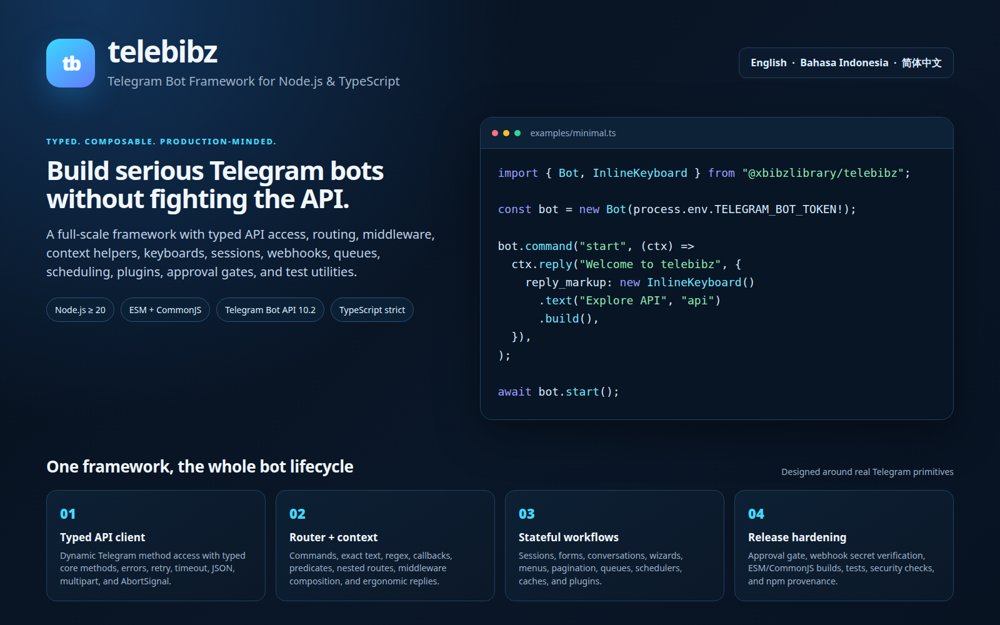

# telebibz API Reference — English
[English](API.md) · [Bahasa Indonesia](API.id.md) · [简体中文](API.zh-CN.md)



This document is the API reference for `@xbibzlibrary/telebibz@0.1.2`. All signatures and behaviors described here are mapped from the package's exported TypeScript source. If a Telegram type does not have a specific parameter/result mapping, the package still provides runtime access via a dynamic API, but the parameter types remain generic.

> **Implementation status.** This documentation describes the capabilities that are actually available in the current release. `MemoryStorage`, `MemoryCache`, `TaskQueue`, and `Scheduler` are in-memory primitives; distributed adapters, external persistence, and full schema typing for the entire Telegram Bot API are not included in this release.

## Installation and import

```bash
npm install @xbibzlibrary/telebibz
```

ESM:

```ts
import {
  Bot,
  InlineKeyboard,
  compose,
  escapeHtml,
  type Context,
} from "@xbibzlibrary/telebibz";
```

CommonJS:

```js
const { Bot, InlineKeyboard } = require("@xbibzlibrary/telebibz");
```

The available subpath exports are as follows.

| Subpath | Content |
|---|---|
| `@xbibzlibrary/telebibz` | The entire main public API from `src/index.ts` |
| `@xbibzlibrary/telebibz/api` | Client, transport, errors, and all Telegram API types |
| `@xbibzlibrary/telebibz/keyboard` | `InlineKeyboard`, `ReplyKeyboard`, and keyboard helpers |
| `@xbibzlibrary/telebibz/testing` | `MockTransport` and test factories |

---

## 1. Core Bot

### `BotStatus`

```ts
type BotStatus =
  | "created"
  | "initialized"
  | "awaiting-approval"
  | "starting"
  | "running"
  | "stopping"
  | "stopped"
  | "error";
```

### `BotOptions<S>`

| Property | Type | Default | Description |
|---|---|---:|---|
| `token` | `string` | required | BotFather token in the format `<digits>:<token>`. |
| `apiBaseUrl` | `string` | `https://api.telegram.org` | Telegram API base URL. Trailing `/` is removed automatically. |
| `transport` | `Transport` | `FetchTransport` | Custom transport for mocks, proxies, or other implementations. |
| `transportOptions` | `Omit<FetchTransportOptions, "baseUrl">` | `{}` | Timeout, retry, backoff, jitter, headers, and fetch implementation. |
| `session` | `Storage<string, S>` | new storage | Session storage keyed by chat/user; any storage adapter may be used. |
| `services` | `Record<string, unknown>` | `{}` | Dependencies/services available via `ctx.services`. |
| `polling.timeout` | `number` | `30` | Long-poll timeout in seconds for `getUpdates`. |
| `polling.limit` | `number` | `100` | Maximum number of updates per polling request. |
| `polling.allowedUpdates` | `string[]` | `[]` | Telegram update filters. |
| `polling.retryDelayMs` | `number` | `500` | Initial delay when polling fails. |
| `polling.maxRetryDelayMs` | `number` | `30000` | Maximum reconnect delay. |
| `approval` | `ApprovalOptions` | disabled | Enable approval gate for the owner. |

### Constructor `Bot`

```ts
new Bot<S extends object = Record<string, unknown>>(
  options: string | BotOptions<S>,
): Bot<S>
```

If the argument is a string, it is treated as the token. The constructor creates `ApiClient`, router, event bus, plugin manager, session storage, and approval gate if configured. The constructor emits the `bot:created` event asynchronously.

The constructor throws `Error` if the token is empty or does not match the Telegram token pattern.

### Properties and getters `Bot`

| API | Type | Description |
|---|---|---|
| `api` | `ApiClient` | Telegram typed/dynamic client. |
| `router` | `Router<Context<S>>` | Bot's main router. |
| `events` | `EventBus<EventMap>` | Event bus for lifecycle, updates, API, webhook, and polling. |
| `plugins` | `PluginManager<Context<S>>` | Plugin lifecycle manager. |
| `session` | `Storage<string, S>` | Bot session; any persistent adapter may be used. |
| `services` | `Record<string, unknown>` | A copy of services provided to the constructor. |
| `approval` | `ApprovalGate \| undefined` | Approval gate if `approval` is configured. |
| `token` | `string` | Bot token used by the client. |
| `status` | `BotStatus` | Current lifecycle status. |
| `botInfo` | `User \| undefined` | Last stored result of `getMe()`. |

### `bot.use(...middleware)`

```ts
use(...middleware: Middleware<Context<S>>[]): this
```

Adds global middleware. Middleware are executed before the router on every update, in registration order. Returns the bot instance for chaining.

### `bot.command(name, handler)`

```ts
command(name: string, handler: Middleware<Context<S>>): this
```

Registers a Telegram command with or without the leading `/`. Matching takes the first token after `/` and ignores bot mentions after `@`. For example, `/start@my_bot` matches `"start"`.

### `bot.callback(pattern, handler)`

```ts
callback(pattern: string | RegExp, handler: Middleware<Context<S>>): this
```

Shortcut for a callback query route. A string ending with `*` means prefix matching; other strings must match exactly.

### `bot.onText(text, handler)`

```ts
onText(text: string, handler: Middleware<Context<S>>): this
```

Handles messages whose `message.text` is exactly equal to `text`.

### `bot.onRegex(expression, handler)`

```ts
onRegex(expression: RegExp, handler: Middleware<Context<S>>): this
```

Handles message text using a `RegExp`. Route parameters are not automatically extracted into `ctx.params`; use a predicate or custom middleware if extraction is needed.

### `bot.usePlugin(plugin)`

```ts
usePlugin(plugin: Plugin<Context<S>>): this
```

Registers a plugin. Plugin names must be unique.

### `bot.init()`

```ts
init(): Promise<this>
```

Calls `getMe()`, stores the bot information, processes the approval gate if active, then runs plugin lifecycle `setup()` and `start()`.

If approval has not been granted, the method sets the status to `"awaiting-approval"`, notifies the owner via the `ApprovalGate`, and returns the bot without marking it as `initialized`. Subsequent calls can be used after the owner grants approval.

`init()` is idempotent when the status is already `initialized` or `running`.

### `bot.start()`

```ts
start(): Promise<void>
```

Shortcut for `launch({ mode: "polling" })`. This method runs long polling and waits until polling is stopped or fails fatally.

### `bot.launch(options?)`

```ts
launch(options?: {
  mode: "polling";
  timeout?: number;
  allowedUpdates?: string[];
}): Promise<void>
```

Runs the bot in polling mode. On start, the lifecycle moves through `starting` to `running`, then the `getUpdates()` loop processes each update sequentially. Polling failures emit `polling:reconnect` and use exponential backoff.

Modes other than `"polling"` throw an error and suggest using `createWebhookHandler()` for webhooks.

### `bot.stop()`

```ts
stop(): Promise<void>
```

Stops polling via an `AbortController`, runs `plugins.dispose()`, sets the status to `stopped`, and emits stopping/stopped events. Calling it when the status is `created` or `stopped` does nothing.

### `bot.restart()`

```ts
restart(): Promise<void>
```

Runs `stop()` and then `start()`.

### `bot.health()`

```ts
health(): Promise<HealthStatus>
```

Calls `getMe()` to check API reachability. It does not throw on request failures; failures are returned as `apiReachable: false` with an error message.

```ts
interface HealthStatus {
  status: BotStatus;
  apiReachable: boolean;
  bot?: User;
  checkedAt: string; // ISO timestamp
  error?: string;
}
```

### `bot.getMe()`

```ts
getMe(): Promise<User>
```

Fetches the bot data from Telegram and updates `botInfo`.

### `bot.setCommands(commands, scope?, languageCode?)`

```ts
setCommands(
  commands: BotCommand[],
  scope?: BotCommandScope,
  languageCode?: string,
): Promise<true>
```

Shortcut to `setMyCommands`. `languageCode` is mapped to Telegram's `language_code` field.

### `bot.deleteCommands(scope?, languageCode?)`

```ts
deleteCommands(
  scope?: BotCommandScope,
  languageCode?: string,
): Promise<true>
```

Shortcut to `deleteMyCommands`.

### `bot.handleUpdate(update)`

```ts
handleUpdate(update: Update): Promise<void>
```

Processes a single update manually. The method determines the session key from `chat.id` and `from.id`, creates a `Context`, emits `update` and `message` events, runs middleware then the router, and saves the session after the pipeline completes.

If approval is active and the bot has not been approved, normal updates are stopped. Approval callbacks are still forwarded to `ApprovalGate.handleCallback()`.

Pipeline errors set the bot status to `error`, emit `bot:error`, and then rethrow the error.

### Minimal bot example

```ts
import { Bot, InlineKeyboard } from "@xbibzlibrary/telebibz";

const bot = new Bot({
  token: process.env.TELEGRAM_BOT_TOKEN!,
  polling: { allowedUpdates: ["message", "callback_query"] },
});

bot.command("start", async (ctx) => {
  await ctx.reply("Hello from telebibz", {
    reply_markup: new InlineKeyboard()
      .text("Status", "status")
      .build(),
  });
});

bot.callback("status", async (ctx) => {
  await ctx.answerCallbackQuery("Bot is active");
  await ctx.reply("Status: running");
});

await bot.start();
```

---

## 2. Event bus

### `EventMap`

| Event | Payload |
|---|---|
| `bot:created` | `{ bot: unknown }` |
| `bot:initialized` | `{ bot: unknown }` |
| `bot:starting` | `{ bot: unknown }` |
| `bot:started` | `{ bot: unknown }` |
| `bot:stopping` | `{ bot: unknown }` |
| `bot:stopped` | `{ bot: unknown }` |
| `bot:error` | `{ bot: unknown; error: unknown }` |
| `update` | `{ update: unknown }` |
| `message` | `{ message: unknown }` |
| `command` | `{ name: string; update: unknown }` |
| `callback` | `{ data: string; update: unknown }` |
| `api:request` | `{ method: string; payload: unknown }` |
| `api:response` | `{ method: string; durationMs: number; response: unknown }` |
| `api:error` | `{ method: string; durationMs: number; error: unknown }` |
| `webhook:request` | `{ update: unknown }` |
| `polling:reconnect` | `{ error: unknown; attempt: number }` |

### `EventBus<Events>`

```ts
new EventBus<Events extends Record<string, unknown> = EventMap>()
```

| Method | Signature | Behavior |
|---|---|---|
| `on` | `on<K>(event: K, listener: (payload: Events[K]) => void \| Promise<void>): () => void` | Adds a listener and returns an unsubscribe function. |
| `once` | `once<K>(event: K, listener: ...): () => void` | Listener is called only once, then removed. |
| `off` | `off<K>(event: K, listener: ...): void` | Removes a specific listener. |
| `emit` | `emit<K>(event: K, payload: Events[K]): Promise<void>` | Calls listeners sequentially and awaits each. |
| `removeAllListeners` | `removeAllListeners(): void` | Removes all listeners. |
| `listenerCount` | `listenerCount<K>(event: K): number` | Returns the number of listeners for the event. |

```ts
const unsubscribe = bot.events.on("bot:error", ({ error }) => {
  console.error(error);
});
unsubscribe();
```

---

## 3. API client, transport, and errors

### Basic types

```ts
type ChatId = number | string;
type ParseMode = "Markdown" | "MarkdownV2" | "HTML";
type InputFile =
  | string
  | Uint8Array
  | ArrayBuffer
  | Blob
  | NodeJS.ReadableStream
  | { source: string | Uint8Array | ArrayBuffer | Blob | NodeJS.ReadableStream; filename?: string };
```

`InputFile` string can be a plain string or a file path when used as the `source` in an upload object. In Node.js, absolute paths, `./...`, and `../...` are read by `FetchTransport` and then sent as multipart files.

### `TelegramResponse<T>`

```ts
interface TelegramResponse<T> {
  ok: boolean;
  result?: T;
  description?: string;
  error_code?: number;
  parameters?: ResponseParameters;
}
```

### `TransportRequest`, `TransportResponse`, and `Transport`

```ts
interface TransportRequest {
  method: string;
  payload?: Record<string, unknown>;
  signal?: AbortSignal;
}

interface TransportResponse<T = unknown> {
  status: number;
  headers: Headers;
  data: TelegramResponse<T>;
}

interface Transport {
  request<T>(request: TransportRequest): Promise<TransportResponse<T>>;
}
```

### `FetchTransportOptions`

| Property | Default | Description |
|---|---:|---|
| `baseUrl` | `https://api.telegram.org` | URL prefix before `/<method>`. |
| `fetch` | `globalThis.fetch` | Custom fetch implementation. |
| `timeoutMs` | `30000` | Timeout per attempt. |
| `retries` | `2` | Number of retries for network errors after the initial attempt. |
| `backoffMs` | `250` | Initial exponential delay. |
| `maxBackoffMs` | `8000` | Transport delay cap. |
| `jitter` | `0.2` | Random variation ±20% of the exponential delay. |
| `headers` | `{}` | Additional headers. |

### `new FetchTransport(options?)`

```ts
new FetchTransport(options?: FetchTransportOptions): FetchTransport
```

Default transport based on `fetch`. Payloads without uploads are sent as JSON. Payloads that contain `Uint8Array`, `ArrayBuffer`, `Blob`, or nested uploads are sent as `multipart/form-data` using `FormData`.

### `fetchTransport.request(request)`

```ts
request<T>(request: TransportRequest): Promise<TransportResponse<T>>
```

Sends a POST to `${baseUrl}/${method}`. Methods with a leading `/` are normalized. External AbortSignals are forwarded to the internal controller. Network errors considered retryable are retried with exponential backoff and jitter; when retries are exhausted, the error is wrapped as a `TelegramNetworkError`.

### `ApiHookContext`, `ApiClientOptions`, and `ApiMethods`

```ts
interface ApiHookContext {
  method: string;
  payload: unknown;
  startedAt: number;
  durationMs?: number;
  response?: TelegramResponse<unknown>;
  error?: unknown;
}

interface ApiClientOptions {
  transport: Transport;
  hooks?: {
    onRequest?: (context: ApiHookContext) => void | Promise<void>;
    onResponse?: (context: ApiHookContext) => void | Promise<void>;
    onError?: (context: ApiHookContext) => void | Promise<void>;
  };
}
```

`ApiMethods` is a mapped type of the 184 `TelegramMethodName`s:

```ts
type ApiMethods = {
  [M in TelegramMethodName]:
    (...args: ApiCallArgs<M>) => Promise<ApiResult<M>>;
};
```

### `new ApiClient(options)`

```ts
new ApiClient(options: ApiClientOptions): ApiClient
```

Creates dynamic proxy methods on `client.methods`. The `onRequest` hook is called before the transport, `onResponse` after a response is received, and `onError` when a request fails or Telegram's response is `ok: false`.

### `api.methods.<method>(params?)`

Dynamic methods can be called directly. Methods that have empty parameters like `getMe()` are called without arguments; other methods accept a single parameter object.

```ts
const me = await bot.api.methods.getMe();
const chat = await bot.api.methods.getChat({ chat_id: "@channel" });
const message = await bot.api.methods.sendMessage({
  chat_id: 123456789,
  text: "Hello",
});
```

### `api.call(method, ...args)`

```ts
call<M extends TelegramMethodName>(
  method: M,
  ...args: ApiCallArgs<M>
): Promise<ApiResult<M>>
```

Typed form for calling a method based on a string literal.

### `api.request(method, payload?, signal?)`

```ts
request<M extends TelegramMethodName>(
  method: M,
  payload?: ApiParams<M>,
  signal?: AbortSignal,
): Promise<ApiResult<M>>
```

Low-level request method that allows an explicit `AbortSignal`.

### `api.raw(method, payload?, signal?)`

```ts
raw(
  method: string,
  payload?: Record<string, unknown>,
  signal?: AbortSignal,
): Promise<unknown>
```

Calls an arbitrary method string on the transport. Use this for Telegram methods or new parameters not yet included in `TelegramMethodMap`. Responses with `ok: false` are still converted into a `TelegramError`.

### Available typed parameters and results

The following types are specially mapped in this release.

| Method | Parameter | Result |
|---|---|---|
| `getMe` | tidak ada | `User` |
| `getUpdates` | `GetUpdatesParams` | `Update[]` |
| `setWebhook` | `SetWebhookParams` | `boolean` |
| `deleteWebhook` | `{ drop_pending_updates?: boolean }` | `boolean` |
| `getWebhookInfo` | tidak ada | `WebhookInfo` |
| `sendMessage` | `SendMessageParams` | `Message` |
| `editMessageText` | `EditMessageTextParams` | `Message \| true` |
| `deleteMessage` | `DeleteMessageParams` | `true` |
| `answerCallbackQuery` | `AnswerCallbackQueryParams` | `true` |
| `getChat` | `GetChatParams` | `Chat` |
| `getFile` | `GetFileParams` | `File` |
| `getUserProfilePhotos` | `{ user_id: number; offset?: number; limit?: number }` | `UserProfilePhotos` |
| `sendPhoto` | `SendPhotoParams` | `Message` |
| `sendDocument` | `SendDocumentParams` | `Message` |

Additional parameter types available are `ReplyParameters`, `LinkPreviewOptions`, `InlineKeyboardButton`, `ReplyMarkup`, `BotCommand`, `BotCommandScope`, and all Telegram update types exported from `api/types.ts`.

### API Errors

```ts
type TelegramErrorKind =
  | "retryable"
  | "rate-limit"
  | "authentication"
  | "validation"
  | "network"
  | "server"
  | "unknown";
```

#### `TelegramError`

```ts
new TelegramError(message: string, options: {
  method: string;
  payload: unknown;
  errorCode?: number;
  parameters?: ResponseParameters;
  status?: number;
  kind?: TelegramErrorKind;
  cause?: unknown;
})
```

Public properties are `kind`, `errorCode`, `parameters`, `method`, `payload`, and `status`. The `retryAfter` getter reads `parameters.retry_after`; the `migrateToChatId` getter reads `parameters.migrate_to_chat_id`.

#### Subclass errors

| Class | `name` | forced `kind` |
|---|---|---|
| `TelegramRateLimitError` | `TelegramRateLimitError` | `rate-limit` |
| `TelegramAuthError` | `TelegramAuthError` | `authentication` |
| `TelegramValidationError` | `TelegramValidationError` | `validation` |
| `TelegramNetworkError` | `TelegramNetworkError` | `network` |

All four subclasses use the same constructor options as `TelegramError`.

#### `classifyTelegramError(errorCode?, status?)`

```ts
classifyTelegramError(
  errorCode?: number,
  status?: number,
): TelegramErrorKind
```

Actual classification: `429` becomes `rate-limit`; error `401` or HTTP `401/403` becomes `authentication`; error codes `400–499` become `validation`; HTTP `500+` becomes `server`; otherwise `unknown`.

#### `telegramErrorFromResponse(response, context)`

```ts
telegramErrorFromResponse<T>(
  response: TelegramResponse<T>,
  context: { method: string; payload: unknown; status?: number },
): TelegramError
```

Converts a failed Telegram response into the appropriate subclass. `429`, auth, and validation errors produce specific subclasses; other errors produce a plain `TelegramError`.

---

## 4. Context

### `ContextOptions<S>`

```ts
interface ContextOptions<S extends object = Record<string, unknown>> {
  update: Update;
  api: ApiClient;
  session: S;
  services: Record<string, unknown>;
}
```

### `Context<S>` properties

| Properti | Isi |
|---|---|
| `update` | Raw Telegram update. |
| `api` | The bot's `ApiClient`. |
| `session` | Mutable session object for the current update key. |
| `state` | Per-context transient object, not automatically saved to the session. |
| `services` | Services injected via `BotOptions.services`. |
| `params` | Route parameters object; the built-in router currently does not populate it automatically. |
| `message` | The main message from message/edited/channel/business/guest updates. |
| `chat` | `message.chat` when available. |
| `from` / `sender` | User from the message, callback query, or inline query. |
| `callbackQuery` | `update.callback_query`. |
| `inlineQuery` | `update.inline_query`. |
| `poll` | `update.poll`. |
| `pollAnswer` | `update.poll_answer`. |
| `chatMember` | `update.chat_member`. |
| `myChatMember` | `update.my_chat_member`. |
| `chatJoinRequest` | `update.chat_join_request`. |
| `reaction` | `update.message_reaction`. |
| `boost` | `chat_boost` or `removed_chat_boost`. |

### `new Context(options)`

```ts
new Context<S>(options: ContextOptions<S>): Context<S>
```

### Context message methods

| Method | Signature | Behavior |
|---|---|---|
| `reply` | `reply(text, extra?): Promise<Message>` | Sends a message to the update chat and sets `reply_parameters.message_id` if there is a message. |
| `send` | `send(text, extra?): Promise<Message>` | Sends a message to the update chat without a reply reference. |
| `edit` | `edit(text, extra?): Promise<Message \| true>` | Edits the update message using `editMessageText`. |
| `delete` | `delete(): Promise<true>` | Deletes the update message. |
| `copy` | `copy(fromChatId, messageId, extra?): Promise<unknown>` | Calls `copyMessage` to the context chat. |
| `forward` | `forward(fromChatId, messageId, extra?): Promise<Message>` | Calls `forwardMessage` to the context chat. |
| `pin` | `pin(messageId?, extra?): Promise<true>` | Calls `pinChatMessage`; defaults to the context message id. |
| `unpin` | `unpin(messageId?, extra?): Promise<true>` | Calls `unpinChatMessage`; defaults to the context message id. |
| `react` | `react(reaction, extra?): Promise<true>` | Calls `setMessageReaction`. |
| `answerCallbackQuery` | `answerCallbackQuery(text?, extra?): Promise<true>` | Answers the active callback query. Throws an error if the update is not a callback. |
| `answerInlineQuery` | `answerInlineQuery(results, extra?): Promise<true>` | Answers the active inline query. Throws an error if the update is not an inline query. |
| `getChat` | `getChat(): Promise<Chat>` | Fetches the context chat details. |
| `getUserProfilePhotos` | `getUserProfilePhotos(userId?, extra?): Promise<unknown>` | Fetches the context user's profile photos. |
| `getFile` | `getFile(fileId): Promise<unknown>` | Fetches a file by id. |
| `withReplyMarkup` | `withReplyMarkup(markup): this` | Stores markup in `ctx.state.reply_markup` and returns the context. This method does not automatically send a message. |

`reply`, `send`, `getChat`, and some other helpers throw an error when the update does not have the required chat. `edit` and `delete` require both chat and message.

---

## 5. Middleware and router

### Types of middleware

```ts
type Next = () => Promise<void>;
type Middleware<Context> = (ctx: Context, next: Next) => void | Promise<void>;
```

### `compose(middleware)`

```ts
compose<Context>(
  middleware: readonly Middleware<Context>[],
): (ctx: Context) => Promise<void>
```

Compose middleware in an onion pattern. `next()` runs the next middleware. If the same middleware calls `next()` more than once, compose throws `Error("next() called multiple times")`.

### `middleware(handler)`

```ts
middleware<Context>(handler: Middleware<Context>): Middleware<Context>
```

Identity helper to provide type annotation/inference for middleware.

### `RoutableContext`

Minimal context required by the router: `update`, `message`, `callbackQuery`, and `params`.

### `Router<Context>`

```ts
new Router<Context extends RoutableContext>(): Router<Context>
```

Routes are processed according to priority and registration order. A matching route does not automatically stop subsequent routes; all matching routes may run. If no route matches, `terminal` on `handle` is called.

| Method | Signature | Matching |
|---|---|---|
| `use` | `use(...middleware): this` | Router-global middleware with the highest priority, executed early. |
| `route` | `route(matcher, ...middleware): this` | Boolean or async custom matcher. |
| `command` | `command(name: string \| RegExp, ...middleware): this` | First command from message text starting with `/`. |
| `text` | `text(value: string, ...middleware): this` | Exact text matching. |
| `regex` | `regex(expression: RegExp, ...middleware): this` | `RegExp.test` against the message text or empty string. |
| `callback` | `callback(pattern: string \| RegExp, ...middleware): this` | Exact, prefix with suffix `*`, or regex against callback data. |
| `chat` | `chat(chatId: number \| string, ...middleware): this` | Match `message.chat.id`, numeric or string-equivalent. |
| `predicate` | `predicate(matcher, ...middleware): this` | Semantic alias for a custom matcher. |
| `nest` | `nest(child: Router<Context>): this` | Run a child router as a nested route. |
| `handle` | `handle(ctx, terminal?): Promise<void>` | Evaluate and execute all matching routes. |

```ts
const router = new Router<Context>();
router.use(async (ctx, next) => {
  console.log("before");
  await next();
});
router.callback("page:*", async (ctx) => {
  await ctx.answerCallbackQuery();
});
router.predicate((ctx) => Boolean(ctx.from?.id), async (ctx) => {
  await ctx.reply("Authenticated update");
});
```

**RegExp note.** The router calls `.test()` directly. For expressions with flags `g` or `y`, JavaScript's stateful `lastIndex` property can affect repeated matching.

---

## 6. Keyboard builders

### `InlineKeyboard`

```ts
new InlineKeyboard(): InlineKeyboard
InlineKeyboard.from(rows: InlineKeyboardButton[][]): InlineKeyboard
```

The builder stores rows mutably and all builder methods return `this`.

| Method | Signature | Description |
|---|---|---|
| `from` | `static from(rows): InlineKeyboard` | Creates a keyboard from rows and copies each row. |
| `text` | `text(text, callbackData): this` | Callback button. |
| `url` | `url(text, url): this` | URL button. |
| `webApp` | `webApp(text, url): this` | Web App button. |
| `pay` | `pay(text = "Pay"): this` | Payment button. |
| `copy` | `copy(text, copiedText): this` | Copy text button. |
| `button` | `button(button): this` | Adds a single button to the last row or creates the first row. |
| `row` | `row(...buttons): this` | Adds a new row. |
| `conditional` | `conditional(condition, factory): this` | Runs the factory only if the condition is true. |
| `grid` | `grid(buttons, columns): this` | Splits buttons into rows based on the number of columns. |
| `build` | `build(): InlineKeyboardMarkup` | Produces a new markup. |
| `asReplyMarkup` | `asReplyMarkup(): InlineKeyboardMarkup` | Alias for `build`. |

Each inline button must have `text` and exactly one action. Callback data is limited to a maximum of 64 UTF-8 bytes; violations throw `RangeError`.

```ts
const keyboard = new InlineKeyboard()
  .text("Allow", "approve:123")
  .url("Documentation", "https://example.com")
  .row(
    { text: "A", callback_data: "a" },
    { text: "B", callback_data: "b" },
  )
  .build();
```

### `ReplyKeyboard`

```ts
new ReplyKeyboard(): ReplyKeyboard
```

| Method | Signature | Description |
|---|---|---|
| `text` | `text(text): this` | Plain text button. |
| `contact` | `contact(text): this` | Requests contact. |
| `location` | `location(text): this` | Requests location. |
| `poll` | `poll(text, type?): this` | Requests a poll of type `quiz` or `regular`. |
| `webApp` | `webApp(text, url): this` | Web App button. |
| `button` | `button(button): this` | Adds one button to the last row. |
| `row` | `row(...buttons): this` | Adds a new row. |
| `grid` | `grid(buttons, columns): this` | Splits buttons into a grid. |
| `build` | `build(options?): ReplyKeyboardMarkup` | Produces the markup and merges options. |
| `asReplyMarkup` | `asReplyMarkup(): ReplyKeyboardMarkup` | Alias for `build()` without options. |

`columns` must be a positive integer; otherwise `grid` throws `RangeError`.

### `removeKeyboard(selective?)`

```ts
removeKeyboard(selective = false): ReplyMarkup
```

Generates `{ remove_keyboard: true }`, with `selective: true` if requested.

### `forceReply(placeholder?, selective?)`

```ts
forceReply(placeholder?: string, selective = false): ReplyMarkup
```

Generates a ForceReply. The placeholder is only added if it is truthy.

---

## 7. Storage and cache

### `Storage<K, V>`

```ts
interface Storage<K, V> {
  get(key: K): Promise<V | undefined>;
  set(key: K, value: V, options?: { ttlMs?: number }): Promise<void>;
  delete(key: K): Promise<boolean>;
  has(key: K): Promise<boolean>;
  clear(): Promise<void>;
  keys(): AsyncIterable<K>;
  values(): AsyncIterable<V>;
  entries(): AsyncIterable<[K, V]>;
  update<T extends V>(
    key: K,
    updater: (current: V | undefined) => T | Promise<T>,
    options?: { ttlMs?: number },
  ): Promise<T>;
}
```

### `MemoryStorage<K, V>`

```ts
new MemoryStorage<K, V>(): MemoryStorage<K, V>
```

In-memory implementation based on `Map`. TTLs are cleaned up lazily when keys are read or iterated; there is no background timer. `update` ensures per-key updater operations run serially so concurrent updates for the same key do not unpredictably overwrite each other.

```ts
const sessions = new MemoryStorage<string, { count: number }>();
await sessions.set("user:1", { count: 0 }, { ttlMs: 60_000 });
await sessions.update("user:1", (current) => ({
  count: (current?.count ?? 0) + 1,
}));
```

### `Cache<K, V>`

```ts
interface Cache<K = string, V = unknown> {
  get(key: K): Promise<V | undefined>;
  set(key: K, value: V, ttlMs?: number): Promise<void>;
  delete(key: K): Promise<boolean>;
  invalidate(prefix?: string): Promise<void>;
  getOrSet(key: K, factory: () => V | Promise<V>, ttlMs?: number): Promise<V>;
}
```

### `MemoryCache`

```ts
new MemoryCache(namespace = "telebibz"): MemoryCache
```

Cache that uses strings as keys and applies an internal namespace to each key.

| Method | Behavior |
|---|---|
| `get` | Retrieves the value or `undefined`. |
| `set` | Stores the value with an optional TTL. |
| `delete` | Deletes the key and returns a boolean. |
| `invalidate(prefix = "")` | Removes all keys in the namespace that start with the prefix. |
| `getOrSet` | Returns the value from cache if present; if not, runs the factory, stores its result, then returns it. |

`getOrSet` does not use deduplication locking; the factory may run more than once if called concurrently while the key is missing.

### `RateLimitResult`

```ts
interface RateLimitResult {
  allowed: boolean;
  remaining: number;
  resetAt: number;
  retryAfterMs?: number;
}
```

### `TokenBucketLimiter`

```ts
new TokenBucketLimiter(
  capacity: number,
  refillPerSecond: number,
): TokenBucketLimiter
```

The constructor throws a `RangeError` if either value is not positive. `consume(key, cost = 1)` deducts tokens if available; if there are not enough, it returns `allowed: false` and an estimated `retryAfterMs`. `clear(key?)` removes a single bucket or all buckets.

---

## 8. Queue and scheduler

### `Job<T>` and `QueueOptions`

```ts
interface Job<T = unknown> {
  id: string;
  data: T;
  attempts: number;
  priority: number;
  runAt: number;
  status: "queued" | "running" | "completed" | "failed" | "cancelled";
  error?: unknown;
}

interface QueueOptions {
  concurrency?: number;
  retries?: number;
  backoffMs?: number;
  maxBackoffMs?: number;
}
```

### `TaskQueue<T>`

```ts
new TaskQueue<T>(
  worker: (job: Job<T>, signal: AbortSignal) => Promise<void>,
  options?: QueueOptions,
): TaskQueue<T>
```

| Method | Signature | Description |
|---|---|---|
| `add` | `add(data, options?): Job<T>` | Adds a job; options `id`, `priority`, `delayMs`. Job is scheduled immediately. |
| `get` | `get(id): Job<T> \| undefined` | Returns a copy of the job status. |
| `cancel` | `cancel(id): boolean` | Cancels a queued or running job and aborts the worker via its `AbortSignal`. |
| `onIdle` | `onIdle(): Promise<void>` | Waits until pending and active are empty. |
| `close` | `close(): Promise<void>` | Stops new draining and cancels the active controller. |

Jobs with higher `priority` are executed first; if equal, jobs with earlier `runAt` are executed first. Retries are attempted until the `retries` value is exceeded. Retry delays use exponential backoff with a default `maxBackoffMs` limit of 30 seconds.

### `ScheduledJob`

```ts
interface ScheduledJob {
  id: string;
  cancel: () => void;
}
```

### `Scheduler`

```ts
new Scheduler(): Scheduler
```

| Method | Signature | Description |
|---|---|---|
| `every` | `every(id, intervalMs, task): ScheduledJob` | Runs a task using `setInterval`. Replaces any timer with the same id. |
| `after` | `after(id, delayMs, task): ScheduledJob` | Runs the task once using `setTimeout`. |
| `cron` | `cron(id, expression, task): ScheduledJob` | Supports the simple `*/N` format in the minutes field, equivalent to an interval of `N * 60_000`. |
| `cancel` | `cancel(id): boolean` | Cancels a timer. |
| `clear` | `clear(): void` | Cancels all timers. |

The full cron format is not supported by the built-in scheduler. Expressions other than `*/N` throw an `Error`.

## 9. Plugins and services

### `Plugin<Context>`

```ts
interface Plugin<Context = unknown> {
  name: string;
  version?: string;
  install?: (api: PluginApi<Context>) => void | Promise<void>;
  setup?: (api: PluginApi<Context>) => void | Promise<void>;
  onStart?: (api: PluginApi<Context>) => void | Promise<void>;
  onUpdate?: (context: Context) => void | Promise<void>;
  onStop?: (api: PluginApi<Context>) => void | Promise<void>;
  dispose?: (api: PluginApi<Context>) => void | Promise<void>;
}
```

### `PluginApi<Context>`

```ts
interface PluginApi<Context> {
  bot: unknown;
  services: ServiceContainer;
  registerMiddleware: (middleware: unknown) => void;
  registerRoute: (route: unknown) => void;
}
```

In this release, `registerMiddleware` and `registerRoute` are available as API hooks but the implementation manager does not yet connect them automatically to the bot/router. Plugins may use `api.bot` and `api.services` directly.

### `ServiceContainer`

```ts
new ServiceContainer(): ServiceContainer
```

| Method | Signature | Description |
|---|---|---|
| `register` | `register<T>(name: string \| symbol, value: T): this` | Stores a service and supports chaining. |
| `get` | `get<T>(name: string \| symbol): T` | Retrieves a service; throws if not registered. |
| `has` | `has(name: string \| symbol): boolean` | Checks for the existence of a service. |
| `delete` | `delete(name: string \| symbol): boolean` | Removes a service. |

### `PluginManager<Context>`

```ts
new PluginManager<Context>(bot: unknown): PluginManager<Context>
```

| Method | Behavior |
|---|---|
| `use(plugin)` | Adds a plugin; duplicate names throw an error. |
| `setup()` | For each plugin, runs `install` then `setup`. |
| `start()` | Executes `onStart` in registration order. |
| `update(context)` | Executes `onUpdate` in registration order. |
| `stop()` | Executes `onStop`. |
| `dispose()` | Executes `dispose` in reverse registration order. |
| `list()` | Returns a read-only list of plugins. |

`Bot.handleUpdate()` in this release does not call `plugins.update()` automatically; call the manager explicitly if plugins require an update lifecycle.

---

## 10. Webhook

### `WebhookOptions`

```ts
interface WebhookOptions {
  secretToken?: string;
  maxBodyBytes?: number;
  onError?: (error: unknown) => void | Promise<void>;
}
```

### `createWebhookHandler(bot, options?)`

```ts
createWebhookHandler<S extends object>(
  bot: Bot<S>,
  options?: WebhookOptions,
): (request: Request) => Promise<Response>
```

The handler accepts a standard Web `Request` and returns a `Response`.

| Condition | Response |
|---|---|
| Method is not POST | `405 Method Not Allowed`, header `allow: POST` |
| Secret header does not match | `401 Unauthorized` |
| Header `Content-Length` or body exceeds limit | `413 Payload Too Large` |
| Invalid JSON or `update_id` is not an integer | `400 Bad Request` for update id; exception during parsing results in `500` |
| `bot.handleUpdate` succeeds | `200 OK` with body `OK` |
| Other exceptions | `500 Internal Server Error` and `onError` is called |

The default value of `maxBodyBytes` is `1_048_576` bytes. The Telegram secret token is read from the `x-telegram-bot-api-secret-token` header.

```ts
import { Bot, createWebhookHandler } from "@xbibzlibrary/telebibz";

const bot = new Bot(process.env.TELEGRAM_BOT_TOKEN!);
const handler = createWebhookHandler(bot, {
  secretToken: process.env.TELEGRAM_WEBHOOK_SECRET,
});

export default { fetch: handler };
```

---

## 11. Conversations, wizards, forms, and menus

### Conversations

```ts
interface ConversationState {
  name: string;
  step: number;
  values: Record<string, unknown>;
  status: "active" | "completed" | "cancelled";
  updatedAt: number;
}
```

#### `ConversationFlow<S>`

```ts
new ConversationFlow(ctx: Context<S>, state: ConversationState)
```

| Method/property | Signature | Description |
|---|---|---|
| `ctx` | `Context<S>` | Current update context. |
| `state` | `ConversationState` | Mutable conversation state. |
| `values` | `Record<string, unknown>` | Alias for `state.values`. |
| `set` | `set<T>(key, value): this` | Stores a value and updates `updatedAt`. |
| `get` | `get<T>(key): T \| undefined` | Retrieves a typed value. |
| `next` | `next(): this` | Advance the step by one. |
| `previous` | `previous(): this` | Decrement the step, clamped at 0. |
| `complete` | `complete(): void` | Sets status to `completed`. |
| `cancel` | `cancel(): void` | Sets status to `cancelled`. |

#### `ConversationManager<S>`

```ts
new ConversationManager<S>(): ConversationManager<S>
```

| Method | Signature | Description |
|---|---|---|
| `start` | `start(key, name, values?): ConversationState` | Creates or replaces a conversation state. |
| `get` | `get(key): ConversationState \| undefined` | Retrieves the active state. |
| `cancel` | `cancel(key): boolean` | Marks as cancelled if it exists. |
| `clearExpired` | `clearExpired(maxAgeMs): number` | Removes states whose `updatedAt` is older than the threshold. |
| `run` | `run(ctx, key, name, steps): Promise<ConversationState>` | Runs steps according to `state.step`; if no step, status becomes completed. |

```ts
const conversations = new ConversationManager();
await conversations.run(ctx, "chat:1", "profile", [
  async (flow) => {
    flow.set("name", ctx.message?.text);
    flow.next();
  },
  async (flow) => {
    await flow.ctx.reply(`Name: ${flow.get<string>("name")}`);
    flow.complete();
  },
]);
```

#### `Wizard<S>` and `WizardStep<S>`

```ts
interface WizardStep<S> {
  id: string;
  run: (flow: ConversationFlow<S>) => void | Promise<void>;
  optional?: boolean;
}

new Wizard<S>()
```

| Method/property | Description |
|---|---|
| `step(definition)` | Adds a step and returns the wizard. `optional` is stored in the definition but not specially handled by the runner. |
| `run(ctx, key, manager?)` | Runs the wizard steps via `ConversationManager` with the name `"wizard"`. |
| `steps` | Read-only list of steps. |

### Forms

```ts
interface ValidationIssue {
  path: string;
  message: string;
  code?: string;
}

interface Field<T> {
  name: string;
  parse: (input: unknown) => T;
  validate?: (value: T) => string | undefined | Promise<string | undefined>;
  transform?: (value: T) => T | Promise<T>;
  required?: boolean;
}
```

#### `Form<T>`

```ts
new Form<T extends Record<string, unknown>>(): Form<T>
```

| Method | Description |
|---|---|
| `field(definition)` | Registers a typed field by `name`. |
| `parse(input)` | Processes all fields. Returns a union of success or issues. Order: required check, parse, transform, validate. |
| `reset()` | Clears internally stored parsed data. |

Parse result:

```ts
type FormResult<T> =
  | { success: true; data: T }
  | { success: false; issues: ValidationIssue[] };
```

Issues use the code `required`, `parse`, or `invalid`.

#### `validators`

| Validator | Input | Result/Error |
|---|---|---|
| `validators.string` | `unknown` | String; otherwise `TypeError("Expected string")`. |
| `validators.number` | `unknown` | Finite number, including numeric strings; otherwise `TypeError("Expected number")`. |
| `validators.integer` | `unknown` | Integer; otherwise `TypeError("Expected integer")`. |
| `validators.email` | `unknown` | String matching a simple email pattern; otherwise `TypeError("Expected email")`. |
| `validators.url` | `unknown` | String accepted by the `URL` constructor; otherwise `TypeError("Expected URL")`. |

### Pagination and menus

#### `Page<T>`

```ts
interface Page<T> {
  items: T[];
  page: number;
  pageCount: number;
  hasPrevious: boolean;
  hasNext: boolean;
}
```

#### `paginate(items, page, pageSize)`

```ts
paginate<T>(
  items: readonly T[],
  page: number,
  pageSize: number,
): Page<T>
```

Pages use 0-based indexing. Pages that exceed bounds are clamped to the last page. An empty collection still has `pageCount: 1`. Negative/non-integer `page` or `pageSize < 1` throws `RangeError`.

#### `paginationButtons(page, prefix)`

```ts
paginationButtons(
  page: Page<unknown>,
  prefix: string,
): InlineKeyboardButton[]
```

Generates a `Previous` button, an indicator `${page + 1}/${pageCount}` with callback `${prefix}:noop`, and `Next` according to the page flags.

#### `MenuItem`

```ts
interface MenuItem {
  id: string;
  label: string;
  callbackData?: string;
  url?: string;
  visible?: boolean | (() => boolean | Promise<boolean>);
  permission?: string;
}
```

#### `Menu`

```ts
new Menu(id: string): Menu
```

| Method/property | Description |
|---|---|
| `item(item)` | Adds an item and supports chaining. |
| `breadcrumb(label)` | Adds a breadcrumb label. |
| `build()` | Waits for visibility predicates, skips invisible items, then produces an `InlineKeyboard`. URL is prioritized over callbacks. |
| `breadcrumbs` | Read-only array of breadcrumbs. |

`permission` is only stored as item metadata; `Menu.build()` does not perform automatic authorization.

---

## 12. Approval Gate

The approval gate sends a notification to the owner when a bot uses the library for the first time. The default message uses the label `Dev Gantenggg`, includes the bot ID/username and owner ID, and provides `Izinkan` and `Tidak Diizinkan` buttons.

### `ApprovalOptions`

| Property | Type | Default | Description |
|---|---|---:|---|
| `ownerChatId` | `ChatId` | wajib | Destination chat for notifications. |
| `ownerUserId` | `number` | wajib | User ID allowed to press the buttons. |
| `ownerLabel` | `string` | `Dev Gantenggg` | Label on the notification. |
| `requireApproval` | `boolean` | `true` | `false` disables the gate. |
| `notificationCooldownMs` | `number` | `600000` | Pending notification cooldown. |
| `store` | `ApprovalStore` | `MemoryApprovalStore` | Custom approval storage. |

### Approval types

```ts
type ApprovalStatus = "pending" | "approved" | "denied";

interface ApprovalRecord {
  key: string;
  botId: number;
  botUsername?: string;
  ownerUserId?: number;
  status: ApprovalStatus;
  nonce: string;
  requestedAt: number;
  decidedAt?: number;
  decidedBy?: number;
  notificationMessageId?: number;
}

interface ApprovalIdentity {
  bot: User;
  configuredOwnerUserId?: number;
}

interface ApprovalCheck {
  allowed: boolean;
  status: ApprovalStatus | "disabled";
  record?: ApprovalRecord;
}
```

### `ApprovalStore`

```ts
interface ApprovalStore {
  get(key: string): Promise<ApprovalRecord | undefined>;
  set(key: string, record: ApprovalRecord): Promise<void>;
  delete?(key: string): Promise<boolean>;
}
```

### `MemoryApprovalStore`

```ts
new MemoryApprovalStore(): MemoryApprovalStore
```

In-memory storage that returns a copy of the record on `get` and `set`.

### `ApprovalGate`

```ts
new ApprovalGate(api: ApiClient, options: ApprovalOptions): ApprovalGate
```

| Method | Signature | Description |
|---|---|---|
| `check` | `check(identity): Promise<ApprovalCheck>` | Returns approved if the record status is approved; sends a new request if none exists or the cooldown has expired. |
| `handleCallback` | `handleCallback(callback): Promise<{ handled: boolean; status?: ApprovalStatus }>` | Validates the nonce and owner, then performs approve/deny. Invalid callbacks or non-approval callbacks are returned as `handled: false`. |
| `isAllowed` | `isAllowed(botId): Promise<boolean>` | True if approved or the gate is disabled. |
| `revoke` | `revoke(botId): Promise<boolean>` | Deletes the record if the store supports delete. |

Callbacks can only be decided by the configured `ownerUserId`. A random 16-character hexadecimal nonce prevents old callbacks from being reused. Expired callbacks produce an expiration alert.

```ts
const bot = new Bot({
  token: process.env.TELEGRAM_BOT_TOKEN!,
  approval: {
    ownerChatId: 7377733784,
    ownerUserId: 7377733784,
    ownerLabel: "Dev Gantenggg",
  },
});
```

---

## 13. Text Utilities

### `escapeMarkdownV2(value)`

```ts
escapeMarkdownV2(value: string): string
```

Escapes Telegram MarkdownV2 characters: `\\_ * [ ] ( ) ~ ` > # + - = | { } . !`.

### `escapeHtml(value)`

```ts
escapeHtml(value: string): string
```

Converts `&`, `<`, `>`, and `\"` into HTML entities.

### `md`

The following MarkdownV2 helper object is available:

| Method | Conceptual output |
|---|---|
| `md.bold(value)` | `*escaped value*` |
| `md.italic(value)` | `_escaped value_` |
| `md.link(label, url)` | `[escaped label](escaped url)` |
| `md.code(value)` | Inline code with backticks escaped. |
| `md.pre(value, language?)` | Code block with an optional language label. |
| `md.escape(value)` | Alias `escapeMarkdownV2`. |

### `splitMessage(text, options?)`

```ts
splitMessage(
  text: string,
  options?: {
    limit?: number;
    parseMode?: "Markdown" | "MarkdownV2" | "HTML";
  },
): string[]
```

Splits text into chunks with a default limit of `4096` characters. When possible, splitting prefers paragraph, newline, or space boundaries; the hard limit is only used if it lies beyond half of the window. `parseMode` is accepted as an API option but does not yet change the splitting algorithm.

A limit less than 1 will throw a `RangeError`.

### `splitCaption(text)`

```ts
splitCaption(text: string): string[]
```

Alias `splitMessage(text, { limit: 1024 })`.

### `template(templateText, values)`

```ts
template(
  templateText: string,
  values: Record<string, unknown>,
): string
```

Replaces placeholders like `{{ key }}` and nested paths such as `{{ user.name }}`. `null` or `undefined` values are replaced with an empty string; other values are converted with `String()`.

```ts
template("Halo {{ user.name }}", { user: { name: "Ayu" } });
// "Halo Ayu"
```

---

## 14. Testing utilities

Import dari `@xbibzlibrary/telebibz/testing` atau root package.

### `MockTransport`

```ts
new MockTransport(): MockTransport
```

| API | Description |
|---|---|
| `calls` | Array of every received `TransportRequest`. |
| `respond(method, response)` | Configures a static response or payload callback and returns the transport. |
| `request(request)` | Records the request and returns a mock response. The default response is `{ ok: true, result: true }`. |

The mock status is `200` when `ok: true`, or `error_code`/`500` when `ok: false`.

```ts
const transport = new MockTransport()
  .respond("getMe", {
    ok: true,
    result: { id: 1, is_bot: true, first_name: "Test" },
  });
```

### `createMockUpdate(overrides?)`

```ts
createMockUpdate(overrides?: Partial<Update>): Update
```

Creates a default message update with `update_id: 1`, private chat id `1`, user id `2`, and text `/start`. The `overrides` object is shallow-merged with the defaults.

### `createTestBot()`

```ts
createTestBot(): { bot: Bot; transport: MockTransport }
```

Creates a bot with the test token `123456:TEST_TOKEN`, a mocked `getMe()` result for bot id `99`, and a transport that can be inspected through `transport.calls`.

### `createMockContext(bot, update?)`

```ts
createMockContext(
  bot: Bot,
  update?: Update,
): Context
```

Creates a context using the bot API, an empty session, and empty services.

---


## 15. Generated Telegram methods namespace

`generated/api.ts` is the generator's internal source that defines:

```ts
const TELEGRAM_API_VERSION = "10.2";
const TELEGRAM_METHOD_NAMES: readonly string[];
type TelegramMethodName = typeof TELEGRAM_METHOD_NAMES[number];
type GeneratedMethodSpec = {
  params: Record<string, unknown>;
  result: unknown;
};
type GeneratedTelegramMethodMap = {
  [K in TelegramMethodName]: GeneratedMethodSpec;
};
const GENERATED_METHODS: Record<TelegramMethodName, TelegramMethodName>;
```

`TELEGRAM_METHOD_NAMES` contains 184 method names in the generator source. That namespace forms the basis for the `api.methods`, `api.call`, and `api.request` proxies, but the generated file is not exported as a public package subpath in this release. Methods whose params/results are not specifically mapped can be invoked via `api.raw()` or by casting parameters in TypeScript.

For an ungrouped canonical list, the method names available on the generated runtime namespace are:

```text
addStickerToSet,
answerCallbackQuery,
answerChatJoinRequestQuery,
answerGuestQuery,
answerInlineQuery,
answerPreCheckoutQuery,
answerShippingQuery,
answerWebAppQuery,
approveChatJoinRequest,
approveSuggestedPost,
banChatMember,
banChatSenderChat,
close,
closeForumTopic,
closeGeneralForumTopic,
convertGiftToStars,
copyMessage,
copyMessages,
createChatInviteLink,
createChatSubscriptionInviteLink,
createForumTopic,
createInvoiceLink,
createNewStickerSet,
declineChatJoinRequest,
declineSuggestedPost,
deleteAllMessageReactions,
deleteBusinessMessages,
deleteChatPhoto,
deleteChatStickerSet,
deleteEphemeralMessage,
deleteForumTopic,
deleteMessage,
deleteMessageReaction,
deleteMessages,
deleteMyCommands,
deleteStickerFromSet,
deleteStickerSet,
deleteStory,
deleteWebhook,
editChatInviteLink,
editChatSubscriptionInviteLink,
editEphemeralMessageCaption,
editEphemeralMessageMedia,
editEphemeralMessageReplyMarkup,
editEphemeralMessageText,
editForumTopic,
editGeneralForumTopic,
editMessageCaption,
editMessageChecklist,
editMessageLiveLocation,
editMessageMedia,
editMessageReplyMarkup,
editMessageText,
editStory,
editUserStarSubscription,
exportChatInviteLink,
forwardMessage,
forwardMessages,
getAvailableGifts,
getBusinessAccountGifts,
getBusinessAccountStarBalance,
getBusinessConnection,
getChat,
getChatAdministrators,
getChatGifts,
getChatMember,
getChatMemberCount,
getChatMenuButton,
getCustomEmojiStickers,
getFile,
getForumTopicIconStickers,
getGameHighScores,
getManagedBotAccessSettings,
getManagedBotToken,
getMe,
getMyCommands,
getMyDefaultAdministratorRights,
getMyDescription,
getMyName,
getMyShortDescription,
getMyStarBalance,
getStarTransactions,
getStickerSet,
getUpdates,
getUserChatBoosts,
getUserGifts,
getUserPersonalChatMessages,
getUserProfileAudios,
getUserProfilePhotos,
getWebhookInfo,
giftPremiumSubscription,
hideGeneralForumTopic,
leaveChat,
logOut,
pinChatMessage,
postStory,
promoteChatMember,
readBusinessMessage,
refundStarPayment,
removeBusinessAccountProfilePhoto,
removeChatVerification,
removeMyProfilePhoto,
removeUserVerification,
reopenForumTopic,
reopenGeneralForumTopic,
replaceManagedBotToken,
replaceStickerInSet,
repostStory,
restrictChatMember,
revokeChatInviteLink,
savePreparedInlineMessage,
savePreparedKeyboardButton,
sendAnimation,
sendAudio,
sendChatAction,
sendChatJoinRequestWebApp,
sendChecklist,
sendContact,
sendDice,
sendDocument,
sendGame,
sendGift,
sendInvoice,
sendLivePhoto,
sendLocation,
sendMediaGroup,
sendMessage,
sendMessageDraft,
sendPaidMedia,
sendPhoto,
sendPoll,
sendRichMessage,
sendRichMessageDraft,
sendSticker,
sendVenue,
sendVideo,
sendVideoNote,
sendVoice,
setBusinessAccountBio,
setBusinessAccountGiftSettings,
setBusinessAccountName,
setBusinessAccountProfilePhoto,
setBusinessAccountUsername,
setChatAdministratorCustomTitle,
setChatDescription,
setChatMemberTag,
setChatMenuButton,
setChatPermissions,
setChatPhoto,
setChatStickerSet,
setChatTitle,
setCustomEmojiStickerSetThumbnail,
setGameScore,
setManagedBotAccessSettings,
setMessageReaction,
setMyCommands,
setMyDefaultAdministratorRights,
setMyDescription,
setMyName,
setMyProfilePhoto,
setMyShortDescription,
setPassportDataErrors,
setStickerEmojiList,
setStickerKeywords,
setStickerMaskPosition,
setStickerPositionInSet,
setStickerSetThumbnail,
setStickerSetTitle,
setUserEmojiStatus,
setWebhook,
stopMessageLiveLocation,
stopPoll,
transferBusinessAccountStars,
transferGift,
unbanChatMember,
unbanChatSenderChat,
unhideGeneralForumTopic,
unpinAllChatMessages,
unpinAllForumTopicMessages,
unpinAllGeneralForumTopicMessages,
unpinChatMessage,
upgradeGift,
uploadStickerFile,
verifyChat
```

> The list above follows the generated source. If Telegram adds new methods, run `npm run update:telegram` or `telebibz generate` after the schema is updated.

---

## 16. CLI

Binary package is `telebibz`.

```bash
npx telebibz <command>
```

| Command | Behavior |
|---|---|
| `telebibz init [directory]` | Creates a directory, a minimal `index.ts`, and `.env.example`. Default directory `my-telebibz-bot`. |
| `telebibz doctor` | Displays Node version, presence of `TELEGRAM_BOT_TOKEN`, cwd, package name, then health API if the token is available. Exit code becomes 1 if the API is not reachable. |
| `telebibz generate` | Runs the generator method from `scripts/generate-api.mjs`. |
| `telebibz build` | Runs `npm run build`. |
| `telebibz test` | Runs `npm test`. |
| `telebibz webhook` | Checks `TELEGRAM_BOT_TOKEN`, uses `TELEGRAM_WEBHOOK_SECRET` if present, creates a handler, and prints readiness. This command does not create an HTTP server. |
| `telebibz inspect` | Displays cwd and Node version. |
| without command | Displays the help command list. |

Environment variables used by the CLI are `TELEGRAM_BOT_TOKEN` and `TELEGRAM_WEBHOOK_SECRET`.

---

## 17. Main Telegram types

The package exports the most commonly used data types directly.

| Type | Important contents |
|---|---|
| `User` | ID, bot flag, name, username, language, and capability flags. |
| `Chat` | ID, type, title/username/name, forum/direct message indicators. |
| `Message` | ID, date, chat, sender, text/caption, entities, reply, markup, plus an index signature for additional Telegram fields. |
| `Update` | All update fields supported by the source, including message, callback, inline, poll, member, join request, reaction, boost, business, and extension fields. |
| `CallbackQuery` | ID, from, message/inline message id, chat instance, data. |
| `InlineQuery` | ID, from, query, offset, chat type, location. |
| `Poll`, `PollAnswer` | Poll data and answers. |
| `ChatMemberUpdated`, `ChatJoinRequest` | Member changes and join requests. |
| `InlineKeyboardMarkup`, `ReplyKeyboardMarkup`, `ReplyKeyboardRemove`, `ForceReply` | Telegram reply markup forms. |
| `MessageEntity`, `ReplyParameters`, `LinkPreviewOptions` | Entity, reply, and link preview metadata. |
| `BotCommand`, `BotCommandScope`, `WebhookInfo`, `File`, `UserProfilePhotos`, `ChatMember`, `ChatAdministratorRights` | Result/parameter types for API helpers. |

---

## 18. Persistence, full cron, menus, and complete Telegram declarations

### Persistent storage adapters

All storage adapters implement the same `Storage<K, V>` contract. The core package remains free of vendor runtime dependencies; Redis, SQL, and Mongo adapters receive a small driver interface supplied by the application or its chosen vendor client.

| Class | Constructor | Purpose |
|---|---|---|
| `MemoryStorage<K, V>` | `new MemoryStorage()` | Fast in-memory storage with TTL and per-key atomic `update()`. |
| `JsonFileStorage<V>` | `new JsonFileStorage(filePath)` | Atomic JSON-file persistence for single-process deployments. |
| `RedisStorage<V>` | `new RedisStorage(client, prefix?)` | Redis-backed storage through `RedisLikeClient`, including TTL and namespace operations. |
| `SqlStorage<V>` | `new SqlStorage(driver)` | SQL-backed storage through an application-owned `SqlStorageDriver`. |
| `MongoStorage<V>` | `new MongoStorage(collection)` | Mongo collection-backed storage through an application-owned `MongoStorageCollection`. |
| `StorageApprovalStore` | `new StorageApprovalStore(storage)` | Persistent owner-approval records backed by any `Storage<string, ApprovalRecord>`. |

`BotOptions.session` accepts `Storage<string, S>`, so sessions can use any adapter. `ConversationManager` accepts the same storage abstraction and exposes `getAsync()`, `cancelAsync()`, and `clearExpiredAsync()` for durable conversation state.

```ts
const session = new JsonFileStorage<Record<string, unknown>>("./data/sessions.json");
const bot = new Bot({ token: process.env.TELEGRAM_BOT_TOKEN!, session });
```

### Full five-field cron

`parseCronExpression()` supports the standard five fields `minute hour day-of-month month day-of-week`, including wildcards, lists, ranges, and steps such as `*/15 9-17 1,15 * 1-5`. `nextCronOccurrence()` calculates the next local occurrence. `Scheduler.cron()` schedules one-shot timers and reschedules after each execution; task failures are delivered to `Scheduler({ onError })` instead of becoming unhandled promise rejections.

### Router matching mode

`new Router()` is **first-match by default**. This prevents accidental double replies. Use `new Router({ matchMode: "all" })` only when intentional fan-out is required. RegExp matchers reset `lastIndex` before testing, so global or sticky expressions are safe to reuse.

### MenuController and permissions

`Menu` supports permission-aware items, asynchronous visibility and permission predicates, breadcrumbs, and multi-column layouts. `MenuController` adds stateful page rendering and callback dispatch for `select`, `page`, `noop`, and foreign callback data.

### Complete Telegram declaration namespace

The package vendors MIT-licensed Telegram declarations and exposes them as type-only exports through `TelegramTypes`, plus aliases such as `TelegramUser`, `TelegramMessage`, `TelegramUpdate`, and `TelegramApiMethods`. These declarations cover the complete object, union, enum, and method declaration surface without adding a runtime dependency. Core telebibz method maps remain specialized for the methods with direct request/result mappings.

---
## 19. Compatibility and limitations to be aware of

The library targets Node.js `>=20`, uses ESM as the primary module, and also provides a CommonJS build. Webhooks require a runtime that provides Web `Request`, `Response`, `Headers`, `FormData`, `Blob`, and `AbortController`; modern Node.js provides these natively.

The list of generated API methods and the API method map are not the same. `TelegramMethodName` includes 184 runtime names, but `TelegramMethodMap` only has specially-typed parameters/results for the subset listed in the API client section. For other methods, use `api.raw()` or add a type declaration on the application side.

Approval state and other in-memory primitives are lost when the process restarts unless the application provides a persistent adapter. `BotOptions.session` accepts the generic `Storage<string, S>` contract, and `ApprovalGate` can use `StorageApprovalStore` or any custom `ApprovalStore`.

---

## References

[1]: https://core.telegram.org/bots/api "Telegram Bot API — official documentation"
[2]: https://www.npmjs.com/package/@xbibzlibrary/telebibz "@xbibzlibrary/telebibz on npm"
